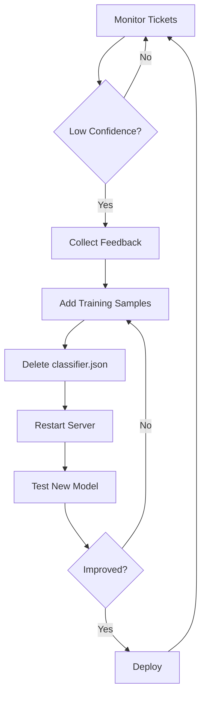

# 🎓 Retraining Guide for NLP Service

This guide shows you how to improve classification accuracy by adding new training samples based on real-world ticket data.

## 📊 When to Retrain

Retrain when you notice:
- **Low confidence scores** (<60%) for common queries
- **Misclassifications** (ticket classified to wrong category)
- **New patterns** in user queries not covered by current training
- **New categories** added to the helpdesk system

## 🔧 Method 1: Direct Code Update (Recommended for Batch Updates)

### Step 1: Identify Misclassifications

Monitor your tickets and identify patterns:
```javascript
// Example: If many "Office 365" tickets are misclassified
Query: "Cannot access Office 365"
Current: Software Installation (60%) ❌
Expected: Account Access ✅
```

### Step 2: Add Training Samples

Edit `server/services/nlpService.js` and add to `trainingData`:

```javascript
const trainingData = [
  // ... existing samples ...
  
  // Add your new samples
  { text: 'Cannot access Office 365', label: 'Account Access' },
  { text: 'Office 365 login not working', label: 'Account Access' },
  { text: 'Need Office 365 license', label: 'Software Installation' },
  { text: 'Outlook 365 sync issues', label: 'Email Issues' },
  { text: 'Teams meeting link not working', label: 'Software Installation' }
];
```

### Step 3: Delete Classifier File

Force retrain by deleting the saved model:
```bash
rm server/data/classifier.json
# Or on Windows:
del server\data\classifier.json
```

### Step 4: Restart Server

```bash
cd server
npm run dev
# You'll see: "🤖 Training Bayes Classifier..." with new sample count
```

## 🔧 Method 2: Programmatic Retraining (For Runtime Updates)

### Via API Endpoint (TODO)

Create an admin endpoint to add training data:

```javascript
// Add to server/routes/admin.routes.js
import { retrainClassifier } from '../services/nlpService.js';

router.post('/retrain-classifier', protect, adminOnly, async (req, res) => {
  try {
    const { samples } = req.body; // [{ text, label }, ...]
    
    const result = await retrainClassifier(samples);
    
    res.json({
      message: 'Classifier retrained successfully',
      totalSamples: result.totalSamples
    });
  } catch (error) {
    res.status(500).json({ error: error.message });
  }
});
```

### Via Direct Function Call

```javascript
import { retrainClassifier } from './services/nlpService.js';

// Add new samples
const newSamples = [
  { text: 'Cannot access SharePoint site', label: 'Account Access' },
  { text: 'SharePoint permissions denied', label: 'Account Access' }
];

retrainClassifier(newSamples);
```

## 📈 Method 3: Learn from Production Data

### Auto-collect Training Data

Add feedback collection to your ticket creation:

```javascript
// In server/controllers/ticket.controller.js
export const createTicket = async (req, res) => {
  try {
    const { subject, description, category } = req.body;
    
    // Classify the ticket
    const classification = classifyTicket(`${subject} ${description}`);
    
    // If user manually overrides category, save as training sample
    if (category && category !== classification.category) {
      await TrainingSample.create({
        text: `${subject} ${description}`,
        aiPrediction: classification.category,
        userCorrection: category,
        confidence: classification.confidence,
        timestamp: new Date()
      });
    }
    
    // ... create ticket
  } catch (error) {
    res.status(500).json({ error: error.message });
  }
};
```

### Periodic Retraining Script

```javascript
// server/utils/autoRetrain.js
import TrainingSample from '../models/TrainingSample.js';
import { retrainClassifier } from '../services/nlpService.js';
import cron from 'node-cron';

// Run every Sunday at 3 AM
cron.schedule('0 3 * * 0', async () => {
  console.log('🤖 Running weekly classifier retraining...');
  
  // Get all user corrections from last week
  const weekAgo = new Date();
  weekAgo.setDate(weekAgo.getDate() - 7);
  
  const samples = await TrainingSample.find({
    timestamp: { $gte: weekAgo },
    confidence: { $lt: 70 } // Only learn from low-confidence mistakes
  });
  
  if (samples.length > 0) {
    const trainingData = samples.map(s => ({
      text: s.text,
      label: s.userCorrection
    }));
    
    await retrainClassifier(trainingData);
    console.log(`✅ Retrained with ${samples.length} new samples`);
  } else {
    console.log('ℹ️ No new training samples found');
  }
});
```

## 🎯 Best Practices for Training Data

### 1. **Variety is Key**
```javascript
// ❌ BAD: Repetitive
{ text: 'reset password', label: 'Password Reset' },
{ text: 'password reset', label: 'Password Reset' },
{ text: 'reset my password', label: 'Password Reset' }

// ✅ GOOD: Varied expressions
{ text: 'I forgot my login credentials', label: 'Password Reset' },
{ text: 'Cannot remember password for email', label: 'Password Reset' },
{ text: 'Account locked after wrong password attempts', label: 'Password Reset' }
```

### 2. **Include Context**
```javascript
// ❌ BAD: Too generic
{ text: 'not working', label: 'Software Installation' }

// ✅ GOOD: Specific context
{ text: 'Excel not working after Windows update', label: 'Software Installation' }
```

### 3. **Balance Categories**
Aim for 10-20 samples per category. Check current distribution:
```javascript
const distribution = trainingData.reduce((acc, sample) => {
  acc[sample.label] = (acc[sample.label] || 0) + 1;
  return acc;
}, {});
console.table(distribution);
```

### 4. **Real User Language**
```javascript
// ❌ BAD: Formal IT language
{ text: 'Experiencing network connectivity issues', label: 'Network Issues' }

// ✅ GOOD: Natural user language
{ text: 'wifi keeps dropping cant stay connected', label: 'Network Issues' }
```

### 5. **Edge Cases**
```javascript
// Include typos, abbreviations, slang
{ text: 'vpn wont conect plz help', label: 'VPN Issues' },
{ text: 'comp crashed need asap', label: 'Hardware Issues' },
{ text: 'pw reset 4 email', label: 'Password Reset' }
```

## 📊 Monitoring Accuracy

### Add Logging to Track Performance

```javascript
// In server/services/nlpService.js - add to classifyTicket()
export const classifyTicket = (text) => {
  const result = /* ... classification logic ... */;
  
  // Log low confidence cases for review
  if (result.confidence < 60) {
    console.warn('⚠️ Low confidence classification:', {
      text: text.substring(0, 50),
      category: result.category,
      confidence: result.confidence
    });
  }
  
  return result;
};
```

### Accuracy Metrics

Create a test suite with known answers:

```javascript
const testCases = [
  { query: 'Cannot login to VPN', expected: 'VPN Issues' },
  { query: 'Printer out of ink', expected: 'Hardware Issues' },
  // ... add 50+ test cases
];

const accuracy = testCases.reduce((correct, test) => {
  const result = classifyTicket(test.query);
  return correct + (result.category === test.expected ? 1 : 0);
}, 0) / testCases.length;

console.log(`Accuracy: ${(accuracy * 100).toFixed(1)}%`);
```

## 🔄 Retraining Workflow



## 📁 Training Data Schema

Create a model to store training samples:

```javascript
// server/models/TrainingSample.js
import mongoose from 'mongoose';

const trainingSampleSchema = new mongoose.Schema({
  text: { type: String, required: true },
  aiPrediction: String,
  userCorrection: { type: String, required: true },
  confidence: Number,
  timestamp: { type: Date, default: Date.now },
  ticketId: { type: mongoose.Schema.Types.ObjectId, ref: 'Ticket' },
  reviewed: { type: Boolean, default: false }
});

export default mongoose.model('TrainingSample', trainingSampleSchema);
```

## 🎓 Advanced: Category-Specific Improvements

If one category has low accuracy:

1. **Analyze Mistakes**
   ```javascript
   // Log all Hardware Issues predictions
   const hwTickets = await Ticket.find({ category: 'Hardware Issues' });
   hwTickets.forEach(ticket => {
     const predicted = classifyTicket(ticket.description);
     if (predicted.category !== 'Hardware Issues') {
       console.log('Misclassified:', ticket.description.substring(0, 50));
     }
   });
   ```

2. **Add Domain-Specific Terms**
   ```javascript
   // For Hardware Issues, add jargon
   { text: 'BSOD blue screen of death', label: 'Hardware Issues' },
   { text: 'kernel panic system freeze', label: 'Hardware Issues' },
   { text: 'thermal throttling overheating', label: 'Hardware Issues' }
   ```

3. **Negative Examples**
   ```javascript
   // Help classifier distinguish between similar categories
   { text: 'Software keeps crashing', label: 'Software Installation' },
   { text: 'Computer keeps shutting down', label: 'Hardware Issues' }
   ```

## 🚀 Next Steps

1. **Week 1**: Monitor classifications, identify top 5 misclassified patterns
2. **Week 2**: Add 10-20 training samples for each pattern
3. **Week 3**: Retrain and measure accuracy improvement
4. **Week 4**: Implement feedback collection system
5. **Month 2**: Set up automated weekly retraining

## 📚 Resources

- [Naive Bayes Text Classification](https://www.analyticsvidhya.com/blog/2021/01/a-guide-to-the-naive-bayes-algorithm/)
- [Training Data Best Practices](https://developers.google.com/machine-learning/data-prep/collect/training-data-best-practices)
- [Active Learning Strategies](https://www.datacamp.com/blog/active-learning-machine-learning)

---

**Remember**: Quality > Quantity. 10 diverse, real-world samples beat 100 generic ones! 🎯
